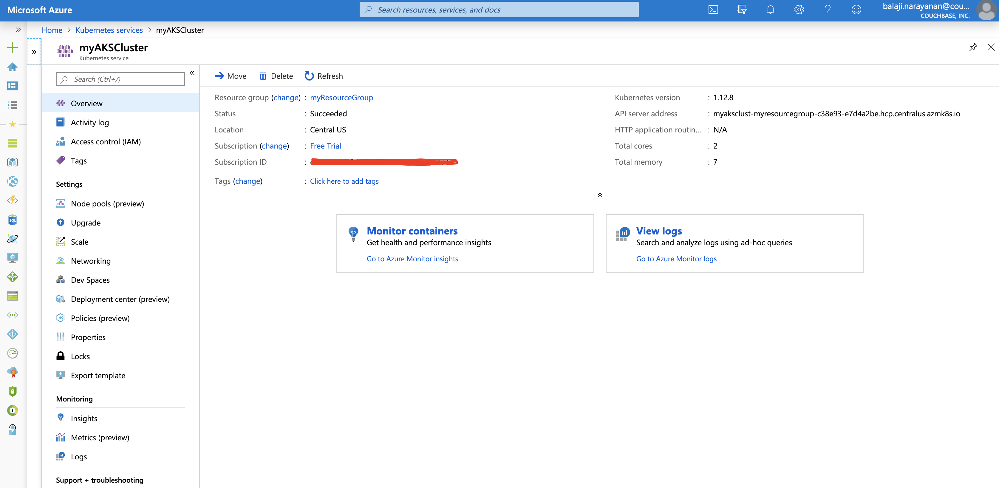

# Setup AKS Cluster

There are different ways to create an AKS cluster. This AKS cluster will be used to deploy Couchbase Autonomous Operator later in the lab. 

Now, let see how AKS cluster is created using the below options.

- Use the Azure CLI
- Use the Azure portal


## Use Azure CLI to create the AKS Cluster

In this section, you deploy an AKS cluster using the Azure CLI.

### Step 1. Create a resource group

An Azure resource group is a logical group in which Azure resources are deployed and managed. When you create a resource group, you are asked to specify a location. This location is where resource group metadata is stored, it is also where your resources run in Azure if you don't specify another region during resource creation. Create a resource group using the `az group create` command.

The following example creates a resource group named `myResourceGroup` in the eastus location.

```
az group create --name myResourceGroup --location centralus
```

The following example output shows the resource group created successfully:

```json
{
  "id": "/subscriptions/<guid>/resourceGroups/myResourceGroup",
  "location": "centralus",
  "managedBy": null,
  "name": "myResourceGroup",
  "properties": {
    "provisioningState": "Succeeded"
  },
  "tags": null,
  "type": null
}
```

### Step 2. Create AKS cluster

Use the `az aks create` command to create an AKS cluster. The following example creates a cluster named _myAKSCluster_ with one node. Azure Monitor for containers is also enabled using the _--enable-addons monitoring_ parameter.

```
az aks create \
    --resource-group myResourceGroup \
    --name myAKSCluster \
    --node-count 2 \
    --enable-addons monitoring \
    --generate-ssh-keys
```

After a few minutes, the command completes and returns JSON-formatted information about the cluster.

### Step 3. Connect to the cluster

- To configure kubectl to connect to your Kubernetes cluster, use the `az aks get-credentials` command. This command downloads credentials and configures the Kubernetes CLI to use them.

	```
	az aks get-credentials --resource-group myResourceGroup --name myAKSCluster
	```

	You should see the following output if Azure credentials are successfully downloaded and 	configured to the Kubernetes CLI.
	
	

- To verify the connection to your cluster, use the `kubectl get` command to return a list of the cluster nodes.

	```
	kubectl get nodes
	```

	The following example output shows the single node created in the previous steps. Make sure that 	the status of the node is Ready:
	
	

---

## Use Azure portal to create the AKS Cluster

In this section, you deploy an AKS cluster using the Azure portal.

### Step 1. Create AKS cluster

In the top left-hand corner of the Azure portal, select **+ Create a resource > Containers > Kubernetes Service**.

To create an AKS cluster, complete the following steps:

1. On the Basics page, configure the following options:

	- **PROJECT DETAILS:** Select an Azure subscription, then select or create an Azure resource 	group, such as `myResourceGroup`. Enter a Kubernetes cluster name, such as `myAKSCluster`.

	- **CLUSTER DETAILS:** Select a region, Kubernetes version, and DNS name prefix for the AKS 	cluster.

	- **PRIMARY NODE POOL:** select a VM size for the AKS nodes. The VM size **cannot** be changed 	once an 	AKS cluster has been deployed.
		- Select the number of nodes to deploy into the cluster. For this quickstart, set **Node 		count** to 1 and **can** be adjusted after the cluster has been deployed.

	
	
	Select **Next: Scale** when complete.
	
2. On the **Scale** page, keep the default options. At the bottom of the screen, click **Next:Authentication**.

3. On the **Authentication** page, configure the following options:

	- Create a new service principal by leaving the **Service Principal** field with **(new) default service 	principal**. Or you can choose _Configure service principal_ to use an existing one. If you use an 	existing one, you will need to provide the SPN client ID and secret.
	
	- Enable the option for Kubernetes role-based access controls (RBAC). This will provide more fine-grained 	control over access to the Kubernetes resources deployed in your AKS cluster.
	
	By default, _Basic_ networking is used, and Azure Monitor for containers is enabled. Click **Review + 	create** and then **Create** when validation completes.

It takes a few minutes to create the AKS cluster. When your deployment is complete, click **Go to resource**, or browse to the AKS cluster resource group, such as myResourceGroup, and select the AKS resource, such as _myAKSCluster_. The AKS cluster dashboard is shown, as in this example:



### Step 2. Connect to the cluster

You can either open Cloud Shell using the `>_` button on the top of the Azure portal, or use command line to perform this step. Then follow the same steps as mentioned in `Step 3. Connect to the cluster` under `Use Azure CLI to create the AKS Cluster`.