## 1. Introduction

It is often desirable by enterprise customers to have standby database cluster/s for data locality and high performance, disaster recovery and/or for mere data backups. Couchbase Cross Data Center Replication (XDCR) requires no introduction as customers have been using this feature for long to achieve these goals in their environment.

However, with more and more Couchbase deployments on the Cloud lately using Couchbase Autonomous Operator (CAO) for Kubernetes, customers have requested for some guidance in setting up networking for their cloud platform.

 This article goes into depth about configuring networks between  Couchbase Clusters in two different regions, using a step-by-step approach. We have used the Amazon AWS platform to deploy the Couchbase cluster in the Amazon EKS environment but we believe the high-level approach would more or less be the same irrespective of the platform of your choice.

## 2. Prerequisites

It is highly recommended that you read through my previous blog on [how to deploy Couchbase Cluster on EKS](https://blog.couchbase.com/deploy-self-healing-highly-available-couchbase-cluster-on-kubernetes-using-persistent-volumes/). Most of the detailed steps on deploying Couchbase Autonomous Operator are just going to be referenced in this article, so we can focus on networking aspects to setup cross-datacenter replication.

## 3. Deploy EKS Clusters in Two Regions

Let's begin by deploying two Amazon Elastic Container Service for Kubernetes (Amazon EKS) in two separate regions (Virginia and Ohio).  

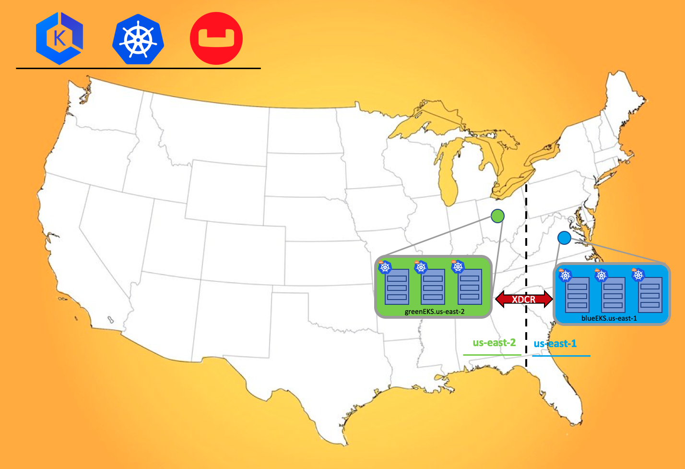
**Figure 1**: EKS cluster deployed in Ohio and Virginia regions.

Each Amazon EKS cluster will have a minimum of three worker nodes, which will be used to host Couchbase pods as described in section 4. Our goal at the end of this article is that you have two Couchbase Clusters deployed on these two Amazon EKS clusters, networking configured and active XDCR established from source to the target cluster.

### 3.1. Deploy EKS in Virginia region

We will use `eksctl` command to deploy Amazon EKS, where we will create a new nodegroup called `bluegroup` with minimum of three `m5.large` instances and a maximum of six.

```
$ eksctl create cluster \
--name blueEKS \
--version 1.14 \
--region us-east-1 \
--zones us-east-1a,us-east-1b,us-east-1c \
--nodegroup-name bluegroup \
--node-type m5.large \
--nodes 3 \
--nodes-min 3 \
--nodes-max 6 \
--node-ami auto \
--vpc-cidr 172.16.0.0/24

[ℹ]  using region us-east-1
...
[✔]  EKS cluster "blueEKS" in "us-east-1" region is ready
```

Once `eksctl` finishes deploying the Kubernestes (K8s) cluster, login to AWS console to note down the VPC-ID and CIDR block. Here are the steps to find out these details, which will later use it in setting up VPC peer.


**Figure 2**: EKS console showing resource dashboard by region.

1. Select `Virginia` region from the dropdown menu.
2. If you see the VPC Dashboard then click `Your VPCs` option from the left pane. If you have a different page open then search for VPC service first and then click `Your VPCs` option.


**Figure 3**: VPC detail page.

3. As can be seen above, you need to select the VPC that just got created and then copy the `VPC ID` into the table below:

#### Table 1. Blue EKS Cluster Attributes

|    Attributes    | Blue Cluster | Green Cluster |
| --------------------- | ----------- | ----------- |
| Region                 | Virginia       |   Ohio    |
| CIDR block               | 172.16.0.0/24        |       |
| VPC-ID              |  vpc-0c8d3d5919e79659d  |  |

### 3.2. Deploy EKS in Ohio region

Next, deploy the Kubernetes cluster in the Ohio region with 3 worker nodes of `m5.large` type. The count and type of these worker nodes can be different depending on the size of the cluster but in this setup, we are going to deploy a 3 node Couchbase cluster on these 3 worker nodes.

```
$ eksctl create cluster \
--name greenEKS \
--version 1.14 \
--region us-east-2 \
--zones us-east-2a,us-east-2b,us-east-2c \
--nodegroup-name greengroup \
--node-type m5.large \
--nodes 3 \
--nodes-min 3 \
--nodes-max 6 \
--node-ami auto \
--vpc-cidr 10.0.0.0/24

[ℹ]  using region us-east-2
...
[✔]  EKS cluster "greenEKS" in "us-east-2" region is ready
```
After the Green cluster is ready, open up a new browser tab and login to AWS console.


**Figure 4**: AWS console connected to Ohio region.

- Change the region to Ohio

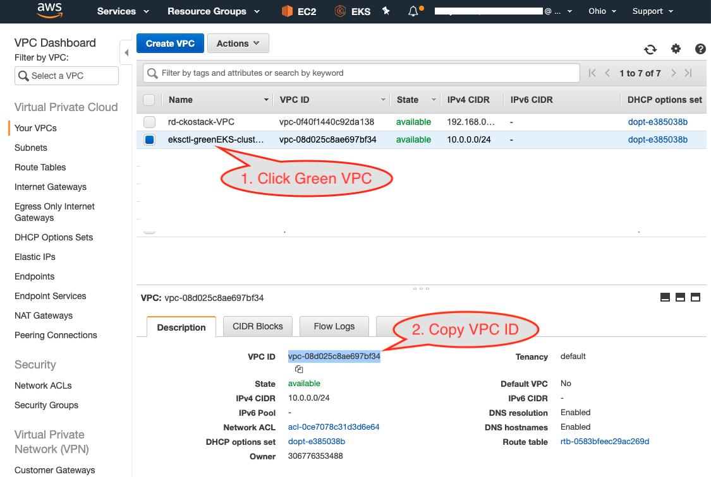
**Figure 5**: VPC details page showing Ohio cluster details.

- From the VPC Dashboard, select `Your VPCs` tab.
- Copy-paste the VPC ID of the Green Cluster into the below table for the record:

#### Table 2. Green EKS Cluster Attributes

|    Attributes    | Blue Cluster | Green Cluster |
| --------------------- | ----------- | ----------- |
| Region                 | Virginia       | Ohio       |
| CIDR block               | 172.16.0.0/24        | 10.0.0.0/24        |
| VPC-ID              |  vpc-0c8d3d5919e79659d  |  vpc-08d025c8ae697bf34  |

At this point, we have Kubernetes cluster deployed on both Virginia and Ohio regions and we have VPC details that we will be used in VPC peering.

### 3.3. Switch Cluster Context

Before we move on to deploying Couchbase Clusters on these two regions, one handy command to remember to switch cluster contexts easily:

```
$ kubectl config get-contexts

CURRENT   NAME                                                    CLUSTER                        AUTHINFO                                                NAMESPACE
*         x.y@domain.com@blueEKS.us-east-1.eksctl.io    blueEKS.us-east-1.eksctl.io    x.y@domain.com@blueEKS.us-east-1.eksctl.io
          x.y@domain.com@greenEKS.us-east-2.eksctl.io   greenEKS.us-east-2.eksctl.io   x.y@domain.com@greenEKS.us-east-2.eksctl.io
```
As can be seen above there will be two different clusters registered within ```kubectl config```. Currently, context is set to ```blueEKS.us-east-1.eksctl.io``` cluster and if we want to switch to ```greenEKS.us-east-2.eksctl.io``` cluster we can simply do this:

```
$ kubectl config use-context x.y@domain.com@greenEKS.us-east-2.eksctl.io

Switched to context "x.y@domain.com@greenEKS.us-east-2.eksctl.io".

$ kubectl get nodes
NAME                                      STATUS    ROLES     AGE       VERSION
ip-10-0-0-11.us-east-2.compute.internal   Ready     <none>    20m      v1.14.8-eks-b8860f
ip-10-0-0-61.us-east-2.compute.internal   Ready     <none>    20m      v1.14.8-eks-b8860f
ip-10-0-0-72.us-east-2.compute.internal   Ready     <none>    20m      v1.14.8-eks-b8860f

```

From here onwards any ```kubectl``` command we run, it will be in context to ```greenEKS.us-east-2.eksctl.io``` cluster which is in ```east-2``` region.

## 4. Deploy Couchbase Cluster in Two Regions

In my last blog on [how to deploy Couchbase Cluster on EKS using persistent volumes](https://blog.couchbase.com/deploy-self-healing-highly-available-couchbase-cluster-on-kubernetes-using-persistent-volumes/), I covered each step in detail. So instead of repeating the steps, here again, I am just going to follow them to keep things simple.

### 4.1 Setup Green Cluster

Let's begin deploying our first Couchbase cluster in ```east-2``` region aka ```green``` in this case. So following the steps from the last [blog](https://blog.couchbase.com/deploy-self-healing-highly-available-couchbase-cluster-on-kubernetes-using-persistent-volumes/), we will:

- Deploy Couchbase Autonomous Operator by following 2.1 to 2.8 steps.
- Create secret and storage-class by performing steps 3.1 to 3.2

We are not going to use cluster deployment script as mentioned there, instead, we will use [couchbase-green-cluster.yaml](../files/xdcr/couchbase-green-cluster.yaml) which will create three-node Couchbase cluster spread across three different availability-zones (east-2a/2b/2c).

```
$ kubectl create -f couchbase-green-cluster.yaml -n emart --save-config

couchbasecluster.couchbase.com/green created

```
> **Note:** It is a best practice to enable ```spec.antiAffinity``` in [couchbase-green-cluster.yaml](../files/xdcr/couchbase-green-cluster.yaml)  to make sure each Kubernetes node get one and only one pod only. This assures that if a node fails, only one Couchbase pod goes down.

```
$ kubectl logs couchbase-operator-7654d844cb-tz7k5 -n emart -f

time="2020-02-22T08:22:02Z" level=info msg="Node status:" cluster-name=green module=cluster
time="2020-02-22T08:22:02Z" level=info msg="┌────────────┬──────────────────┬──────────────┬────────────────┐" cluster-name=green module=cluster
time="2020-02-22T08:22:02Z" level=info msg="│ Server     │ Version          │ Class        │ Status         │" cluster-name=green module=cluster
time="2020-02-22T08:22:02Z" level=info msg="├────────────┼──────────────────┼──────────────┼────────────────┤" cluster-name=green module=cluster
time="2020-02-22T08:22:02Z" level=info msg="│ green-0000 │ enterprise-6.0.3 │ data-east-2a │ managed+active │" cluster-name=green module=cluster
time="2020-02-22T08:22:02Z" level=info msg="└────────────┴──────────────────┴──────────────┴────────────────┘" cluster-name=green module=cluster
time="2020-02-22T08:22:02Z" level=info msg="Scheduler status:" cluster-name=green module=cluster
time="2020-02-22T08:22:02Z" level=info msg="┌──────────────┬────────────┬────────────┐" cluster-name=green module=cluster
time="2020-02-22T08:22:02Z" level=info msg="│ Class        │ Zone       │ Server     │" cluster-name=green module=cluster
time="2020-02-22T08:22:02Z" level=info msg="├──────────────┼────────────┼────────────┤" cluster-name=green module=cluster
time="2020-02-22T08:22:02Z" level=info msg="│ data-east-2a │ us-east-2a │ green-0000 │" cluster-name=green module=cluster
time="2020-02-22T08:22:02Z" level=info msg="└──────────────┴────────────┴────────────┘" cluster-name=green module=cluster
time="2020-02-22T08:22:02Z" level=info cluster-name=green module=cluster
time="2020-02-22T08:22:08Z" level=info msg="Creating a pod (green-0001) running Couchbase enterprise-6.0.3" cluster-name=green module=cluster
time="2020-02-22T08:23:21Z" level=info msg="added member (green-0001)" cluster-name=green module=cluster
time="2020-02-22T08:23:21Z" level=info msg="Creating a pod (green-0002) running Couchbase enterprise-6.0.3" cluster-name=green module=cluster
time="2020-02-22T08:24:31Z" level=info msg="added member (green-0002)" cluster-name=green module=cluster
time="2020-02-22T08:24:39Z" level=info msg="Rebalance progress: 0.000000" cluster-name=green module=cluster
time="2020-02-22T08:24:43Z" level=info msg="reconcile finished" cluster-name=green module=cluster
```
Now we can port forward to view the Couchbase Admin Console:

```
$ kubectl port-forward green-0000 8092:8091 -n emart

Forwarding from 127.0.0.1:8092 -> 8091
Forwarding from [::1]:8092 -> 8091

```
Next open up a browser and type: http://localhost:8092/ to connect to the Couchbase Web Console of `Green` cluster:

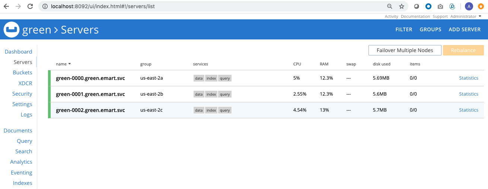
**Figure 6**: Three nodes Green cluster distributed across three availability zones (AZs)

Create an empty bucket ```default```, which will be used later on as the target bucket while setting up XDCR.

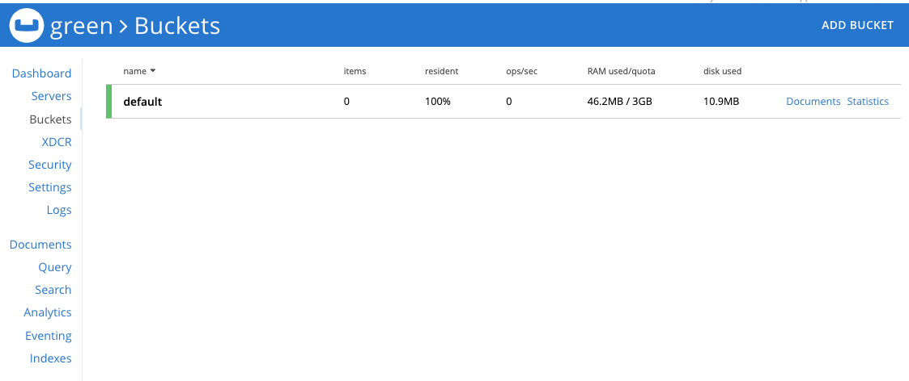
**Figure 7**: Target bucket with no documents in it

### 4.2 Setup Blue Cluster

We need to change the context of ```kubectl config``` in order to work with blueEKS cluster.

```
$ kubectl config use-context x.y@domain.com@blueEKS.us-east-1.eksctl.io

Switched to context "x.y@domain.com@blueEKS.us-east-1.eksctl.io".

$ kubectl get nodes
NAME                          STATUS    ROLES     AGE       VERSION
ip-172-16-0-25.ec2.internal   Ready     <none>    2h       v1.14.8-eks-b8860f
ip-172-16-0-42.ec2.internal   Ready     <none>    2h       v1.14.8-eks-b8860f
ip-172-16-0-76.ec2.internal   Ready     <none>    2h       v1.14.8-eks-b8860f
```

After switching the context, we are going to follow the same steps as described above. We will use [couchbase-blue-cluster.yaml](../files/xdcr/couchbase-blue-cluster.yaml) to finally deploy three-node cluster.

```
$ kubectl create -f couchbase-blue-cluster.yaml -n emart --save-config

couchbasecluster.couchbase.com/green created
```
Now let's take a look at the operator logs to check the progress:

```
$ kubectl get pods -n emart
NAME                                            READY     STATUS    RESTARTS   AGE
couchbase-operator-7654d844cb-58gch             1/1       Running   0          4m22s
couchbase-operator-admission-7ff868f54c-57rhc   1/1       Running   0          5m21s

$ kubectl logs couchbase-operator-7654d844cb-58gch -n emart -f

time="2020-02-22T08:52:07Z" level=info msg="┌───────────┬──────────────────┬──────────────┬────────────────┐" cluster-name=blue module=cluster
time="2020-02-22T08:52:07Z" level=info msg="│ Server    │ Version          │ Class        │ Status         │" cluster-name=blue module=cluster
time="2020-02-22T08:52:07Z" level=info msg="├───────────┼──────────────────┼──────────────┼────────────────┤" cluster-name=blue module=cluster
time="2020-02-22T08:52:07Z" level=info msg="│ blue-0000 │ enterprise-6.0.3 │ data-east-1a │ managed+active │" cluster-name=blue module=cluster
time="2020-02-22T08:52:07Z" level=info msg="└───────────┴──────────────────┴──────────────┴────────────────┘" cluster-name=blue module=cluster
time="2020-02-22T08:52:07Z" level=info msg="Scheduler status:" cluster-name=blue module=cluster
time="2020-02-22T08:52:07Z" level=info msg="┌──────────────┬────────────┬───────────┐" cluster-name=blue module=cluster
time="2020-02-22T08:52:07Z" level=info msg="│ Class        │ Zone       │ Server    │" cluster-name=blue module=cluster
time="2020-02-22T08:52:07Z" level=info msg="├──────────────┼────────────┼───────────┤" cluster-name=blue module=cluster
time="2020-02-22T08:52:07Z" level=info msg="│ data-east-1a │ us-east-1a │ blue-0000 │" cluster-name=blue module=cluster
time="2020-02-22T08:52:07Z" level=info msg="└──────────────┴────────────┴───────────┘" cluster-name=blue module=cluster
time="2020-02-22T08:52:07Z" level=info cluster-name=blue module=cluster
time="2020-02-22T08:52:13Z" level=info msg="Creating a pod (blue-0001) running Couchbase enterprise-6.0.3" cluster-name=blue module=cluster
time="2020-02-22T08:53:27Z" level=info msg="added member (blue-0001)" cluster-name=blue module=cluster
time="2020-02-22T08:53:27Z" level=info msg="Creating a pod (blue-0002) running Couchbase enterprise-6.0.3" cluster-name=blue module=cluster
time="2020-02-22T09:00:45Z" level=info msg="added member (blue-0002)" cluster-name=blue module=cluster
time="2020-02-22T09:00:54Z" level=info msg="Rebalance progress: 0.000000" cluster-name=blue module=cluster
time="2020-02-22T09:00:58Z" level=info msg="reconcile finished" cluster-name=blue module=cluster

```

Port forward Couchbase Admin Console to port 8091:

```
$ kubectl port-forward green-0000 8091:8091 -n emart

Forwarding from 127.0.0.1:8091 -> 8091
Forwarding from [::1]:8091 -> 8091

```
Open up another tab in your browser and type: http://localhost:8091/ to connect to the Couchbase Web Console of `Blue` cluster:

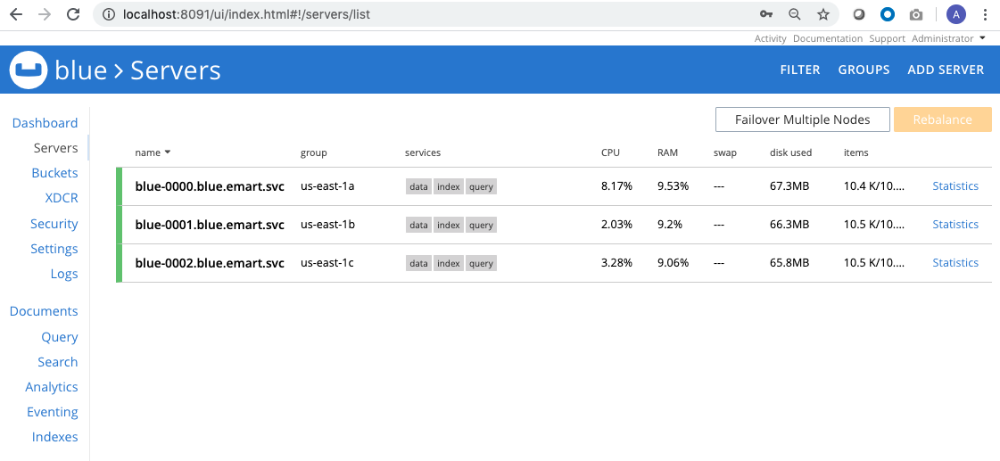
**Figure 8**: Three nodes blue cluster distributed across three availability zones (AZs)

#### 4.2.1 Create travel-sample bucket

We are going to use `travel-sample` bucket as the source data, which we will replicate it to the target `green` cluster. To create a sample bucket, goto Settings>Sample Buckets and then click the checkbox next to `travel-sample`. That will create the required bucket and populate a bunch of documents in the bucket.


**Figure 9**: Source bucket with some sample data

We are going to replicate this travel-sample bucket to the target cluster in the Green (aka Ohio) region.

## 5. Network Configuration

The fun begins with the networking configuration section. If you have already used AWS Console to set up VPC peering between two regions or two separate VPCs then this section is going to breeze. And if you want to learn how to configure VPC peering this is the going to be a great learning experience.


### 5.1 Setup VPC Peering

The first step in the three steps process is to establish VPC peering from the requester VPC to the accepter VPC. In this step, we are going to login to the Virginia region using the AWS console and initiate the peering request. We will then login to the Ohio region to accept this request.

#### 5.1.1 Initiate VPC request from Blue region

Let's begin the VPC peering initiation process by connecting to the Virginia region.


**Figure 10**: AWS console displaying resource summary in the Virginia region

1. Make sure you have selected the requester region from the AWS console, which in our case in Virginia.
2. Bring up the VPC dashboard page.


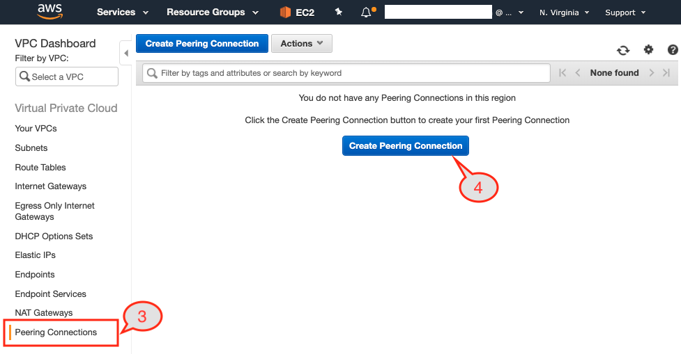
**Figure 11**: VPC peering option under the VPC Dashboard

3. Select the `Peering Connections` option from the left pane.
4. Click `Create Peering Connection` button from the page.

Once you click the button you are going to be presented with a dialog page where we have to:

1. Provide a unique name to this peering connection. We are going to use `blue-to-green-peering` because the Virginia region is hosting our Blue cluster and Ohio is hosting our Green cluster.


**Figure 12**: VPC peering requester and acceptor configuration.

2. Select the VPC ID of the Blue cluster as that is the requester.
3. Our target cluster is in a different region so we are going to select `Another Region` as the option for `Region`.
4. Select the target region next, which is Ohio.
5. We have noted down the VPC IDs of both the VPCs in table 2. So we will use VPC ID of the Green cluster.
6. Hit `Create Peering Connection` button.

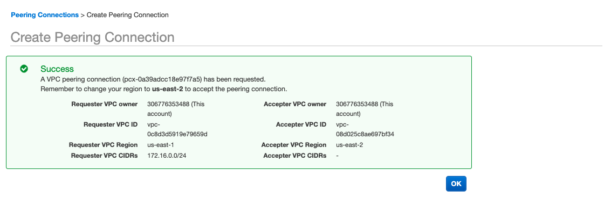
**Figure 13**: Peering request established.

This will display the confirmation page. Just click `OK` button and that will display you that request has been initiated.

#### 5.1.2 Accept VPC request from Green region

Now from AWS console change the region to Ohio (aka Green region) and then select VPC Dashboard.


**Figure 14**: Select us-east-2 (Ohio) region

- Same as before selecting the `Peering Connections` option from the left pane so we can complete the peering request by accepting it.

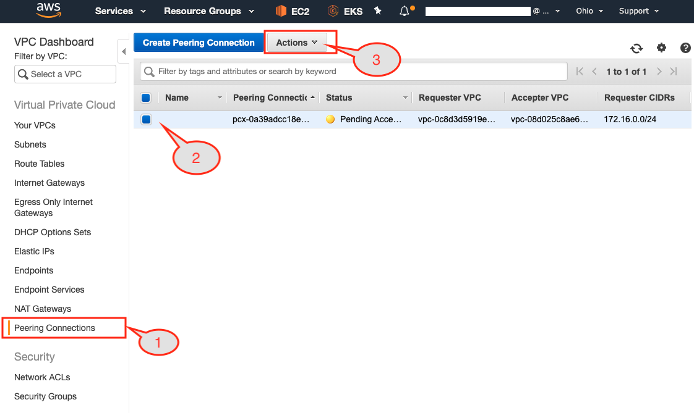

**Figure 15**: Select ```Peering Connections``` options from VPC Dashboard

- As can be seen above, there is one pending request in the list. We will select the request first.

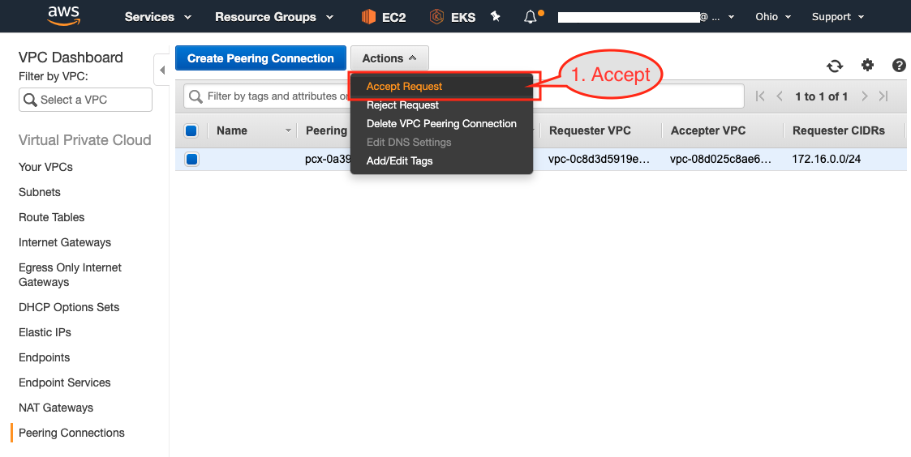

**Figure 16**: Accept VPC peering request

- Then from the `Actions` drop-down button, we will select `Accept Request`.

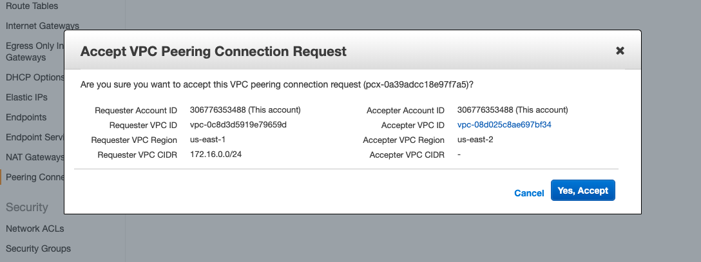

**Figure 17**: Confirm VPC peering request from the popup

- A confirmation page will popup. Select `Yes, Accept` button.

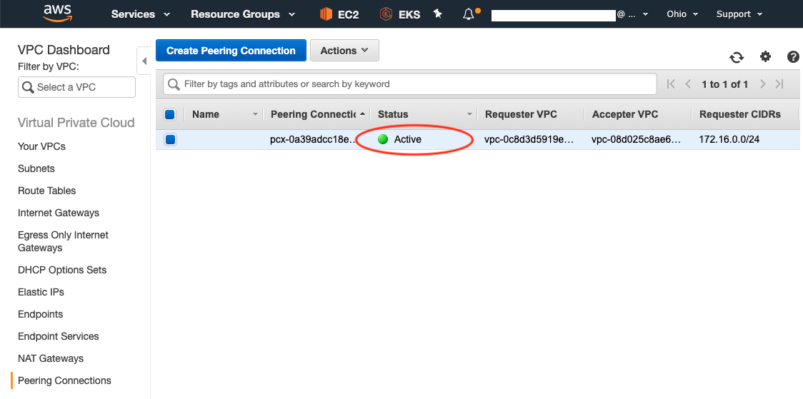

**Figure 18**: VPC peering connection from source-target is established

This completes the VPC peering step one as the status of peering is `Active`.


### 5.2 Update Routing-Tables

Step two is to establish the communication channel by adding the CIDR block of the target cluster into the Route Tables. To do that we need to find out which subnets each of three EC2 instances reside.

Once we have the list of subnets in each of three AZs (1a, 1b, 1c) where we have Kubernetes worker nodes running, we need to find out the Routing Table associated with each of the three subnets. For these Routing Tables, we would like to add a routing table entry so it allows traffic coming from other VPC via VPC peering. Let's take a look at it to step by step.

#### 5.2.1 Subnets used in Blue Cluster

1. Login to AWS console and select the Virginia region (aka Blue region). After that select EC2 service to display all the EC2 instances used as the Kubernetes nodes.

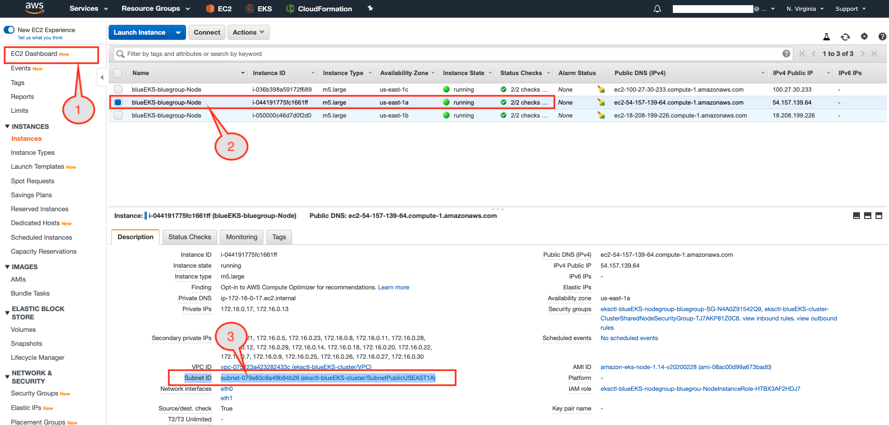

**Figure 19**: Subnet associated to each of the EC2 instances.

2. Next select one of the EC2 instances. In the picture above I have selected instances in the us-east-1a region and the description tab would display all the details about this instance.

3. Note down the subnet Name (mentioned within the parenthesis) this instance is residing into. Like the above instance is deployed within `eksctl-blueEKS-cluster/SubnetPublicUSEAST1A` subnet.

4. Repeat the same process till you have the list of all the subnets used in your cluster. In our case we have these three subnets used within our cluster:

|    Attributes    | us-east-1a | us-east-1b |us-east-1c |
| --------------------- | ----------- |  ----------- | ----------- |
| Subnet Name                 | eksctl-blueEKS-cluster/SubnetPublicUSEAST1A       | eksctl-blueEKS-cluster/SubnetPublicUSEAST1B       | eksctl-blueEKS-cluster/SubnetPublicUSEAST1C       |

#### 5.2.2 Routing Table Associated to Subnets

The next step would be to find out the routing table associated with each of the subnets, so we can add the routing rule to it to allow traffic from Green cluster.

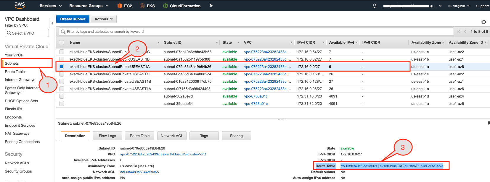
**Figure 20**: Routing Tables associated with each subnet in the cluster

1. In order to find that Routing Table used, click `Subnets` tab on the left.
2. Next select one of the subnet from the list `eksctl-blueEKS-cluster/SubnetPublicUSEAST1A`
3. Make a note of the Routing Table used by looking under the `Description` tab.
4. Repeat above three steps for each of the subnet and note down the routing table used:

|    Attributes    | us-east-1a | us-east-1b |us-east-1c |
| --------------------- | ----------- |  ----------- | ----------- |
| Subnet Name                 | eksctl-blueEKS-cluster/SubnetPublicUSEAST1A       | eksctl-blueEKS-cluster/SubnetPublicUSEAST1B       | eksctl-blueEKS-cluster/SubnetPublicUSEAST1C       |
| Route Table Name                 | eksctl-blueEKS-cluster/PublicRouteTable       | eksctl-blueEKS-cluster/PublicRouteTable       | eksctl-blueEKS-cluster/PublicRouteTable       |

As can be noticed that in our case we have one Route Table `eksctl-blueEKS-cluster/PublicRouteTable` associated with all three subnets, so we are going to update one Route Table only.

#### 5.2.3 Add Routing Rule

Now we are going to add `10.0.0.0/24` CIDR block of the target region into the allowed routing `Routes` of the source routing table.

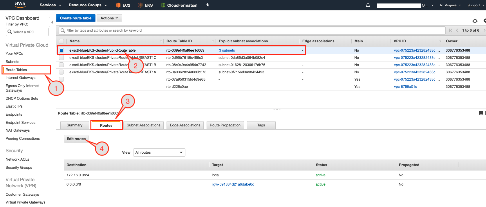
**Figure 21**: Route Tables tab showing list of Routing Tables exist in Blue region

1. Click the `Routing Tables` tab from the left menu of the AWS console.
2. Select the route table we would like to add the route entry to i.e. `eksctl-blueEKS-cluster/PublicRouteTable`.
3. Then click the `Routes` button next to the summary tab, where you would see only two route entries.
4. To allow `10.0.0.0/24` CIDR block click the `Edit routes` button.

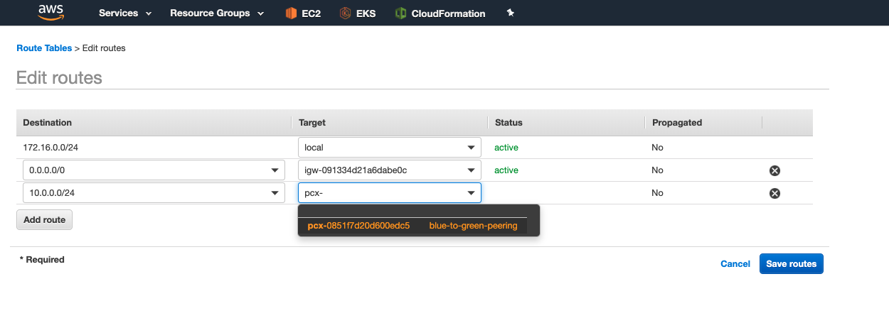
**Figure 22**: Edit Routes dialog page.

5. In the above dialog, page add the CIDR block of the GREEN cluster and select VPC-Peering as the target. Next hit `save routes` button.
6. You would see target CIDR block `10.0.0.0/24` is now part of the `Routes` available for the selected Route Table: `eksctl-blueEKS-cluster/PublicRouteTable`

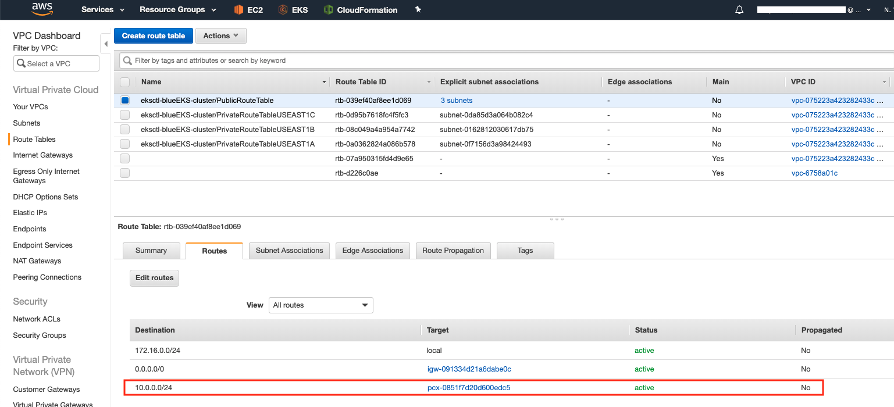
**Figure 23**: Route table showing target CIDR block as the allowed route.

> **Note:**  Repeat the same process for Ohio (aka Green) cluster and add CIDR block of Virginia (aka Blue) into the Route Table.

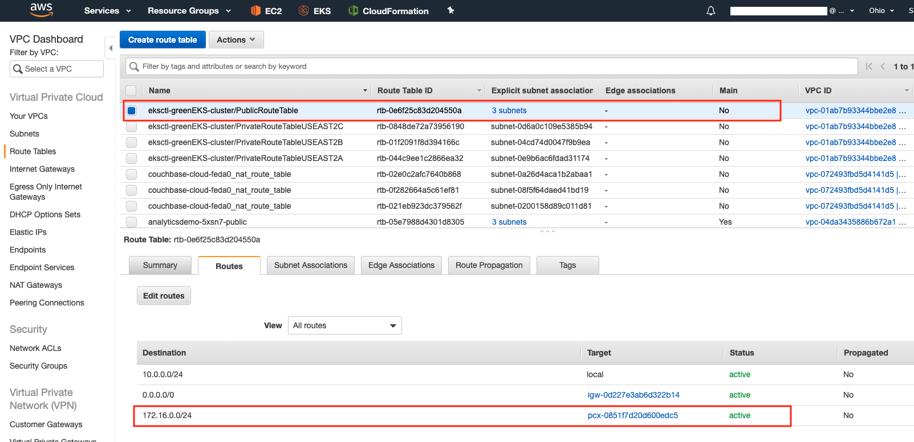
**Figure 24**: Route table showing Blue Cluster CIDR block in the Green Cluster Route Table.


### 5.3 Update Security Group

The last step of setting up networking on both source and target cluster is to open up a range of ports on which K8s worker nodes are going to communicate with each other. These ports are going to be used for [XDCR communication](https://docs.couchbase.com/operator/1.2/xdcr.html#establishing-xdcr-connections) so either we open up port ranging from 30000-32767 or further restrict to a single port which will be used for Overlay Networking as described in 6.0 section.

#### 5.3.1 Inbound Rules settings

To keep things simple we are going to allow the range of ports to be open on the NodeGroup used as K8s worker nodes. To change the firewall settings follow these steps:


**Figure 25**: Setup a Security group on Virginia (aka Blue) cluster.

1. Click the `Security Groups` tab from the left pane of your AWS Console for the Virginia region.
2. Next, locate the security group (SG) with `-nodegroup-bluegroup` as the string in it. This SG is used as the firewall setting for all the worker nodes in your Kubernetes nodegroup.
3. Click `Inbound Rules` tab, which displays a range of ports open for the respective resource.
4. Next click `Edit rules` button to add the new rule to the list.

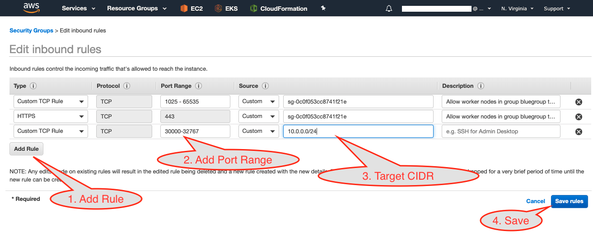
**Figure 26**: Add firewall rule so source and target cluster can communicate with each other.

5. As described in the image above, add a new TCP rule for port range 30000-32767 and use CIDR block `10.0.0.0/24` of target cluster i.e. Ohio (aka Green) cluster. This completes the setting for Inbound traffic.

#### 5.3.2 Outbound rules settings

1. Now let's create a similar rule for Outbound communication as well. To do that click the `Outbound Rules` button as described below.

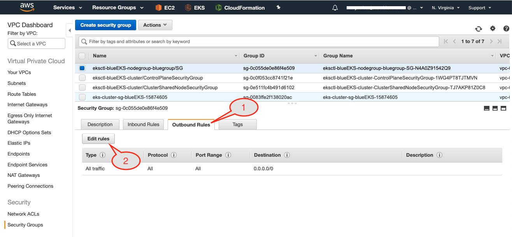
**Figure 27**: Outbound Rules settings for selected security group.

2. Click the `Edit rules` button to add a new rule.


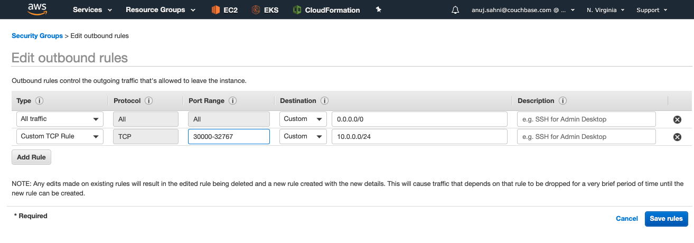
**Figure 28**: Outbound route updated with additional rule.


3. Just as before we will add a new `Custom TCP Rule` and allow port ranging from `30000-32767` to be able to communicate with the target CIDR block `10.0.0.0/24`.

> **Note:** Just like we added firewall rule on the Nodegroup of Blue cluster, we have to do the same on the Nodegroup of the Green Cluster.

After finishing network setting both source and target, clusters should be able to communicate on the port ranges we used and we are good to go to the next step of actually setting up the XDCR so data can be replicated from source to target bucket across the region.

## 6.0 XDCR Replication with Overlay Networking

Take a look at the diagram below, which assumes two nodes in separate Kubernetes clusters can communicate with each other. The router depicted could be a switch, router, VPN connection or any other infrastructure which allows layer 3 communication.

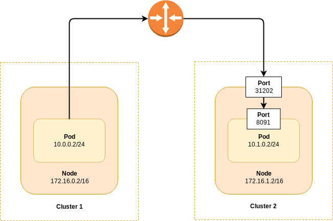
**Figure 29**: XDCR to a Different Kubernetes Cluster via Overlay Networking

In the diagram, the pod in Cluster 1 is only able to connect to the node port (31202) exposed in Cluster 2. Furthermore, that port is only exposed to the node on which the pod is running. To determine the correct connection string on the XDCR target cluster follow the procedure:


1. List the Couchbase pods deployed in the target cluster. If we want to setup XDCR replication on the Blue cluster then run this command from the  `Green` cluster:

```bash
$ kubectl get pods -n emart

NAME                                            READY     STATUS    RESTARTS   AGE
green-0000                                      1/1       Running   0          7m39s
green-0001                                      1/1       Running   0          6m19s
green-0002                                      1/1       Running   0          5m8s
```


2. Choose one of the Couchbase pods and get its underlying GKE node’s IP address:

```bash
$ kubectl get pod green-0000 -o yaml -n emart | grep hostIP

hostIP: 10.0.0.5
```


3. Get the port number that maps to the admin port (8091).

```bash
$ kubectl get service green-0000-exposed-ports -n emart

NAME                       TYPE       CLUSTER-IP      EXTERNAL-IP   PORT(S)                                                                                                                        AGE
green-0000-exposed-ports   NodePort   172.20.55.204   <none>        11210:32262/TCP,11207:31500/TCP,8093:32209/TCP,18093:31965/TCP,8091:30964/TCP,18091:30093/TCP,8092:31555/TCP,18092:30041/TCP   7m3s
```


If you were logged into the Couchbase Server Web Console on the Blue cluster, and establishing the XDCR connection to the Green cluster, you’d use the connection string **10.0.0.5:30964** based on the example above.


### 6.1. XDCR from Blue to Green cluster

We are going to configure a uni-directional replication from the `Blue` to the `Green` cluster. You can find more details on the [XDCR documentation](https://docs.couchbase.com/server/6.0/manage/manage-xdcr/xdcr-management-overview.html).

Let's first connect to Couchbase Web Console of the `Blue` cluster using the port forward method.

> **Note:** We already have port forwarding running for both Green cluster using port `8092` and Blue cluster using a port `8091`.


In the Blue cluster [http://localhost:8091](http://localhost:8091):

- Add cluster reference of the **green** cluster.


**Figure 30**: XDCR connection from Blue to Green cluster.

- Remote cluster reference added.


**Figure 31**: Replication established.

- Add bucket replication from **travel-sample** bucket to **default** bucket on the Green cluster.

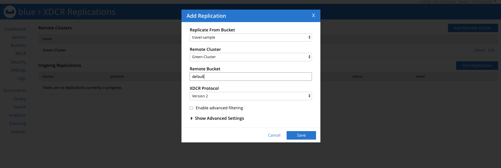
**Figure 32**: Setting up source to target bucket replication.

- Your bucket is now replicating from `Blue` to `Green` cluster.


**Figure 33**: Active replication of buckets from Virginia to Ohio cluster.

## 7. Conclusion

In this article, we have unraveled the networking details to show you how easy it is to set up VPC peering across regions in the context of Couchbase Autonomous Operator. We have used one of the cloud platforms to drive the deployment of the geo-distributed Couchbase cluster but what we want to highlight is that once you understand the concepts then applying those in any cloud platform would be easier.

We hope that you would find the article useful and give it a try to our latest [Couchbase Autonomous Operator 2.0](https://www.couchbase.com/downloads?family=kubernetes&product=open-source-kubernetes-developer) to build your next-generation applications.
